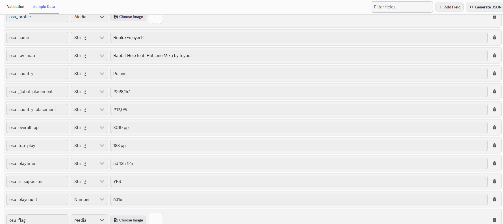
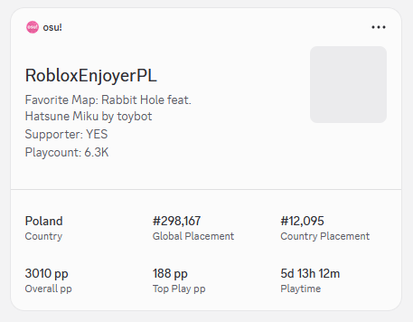
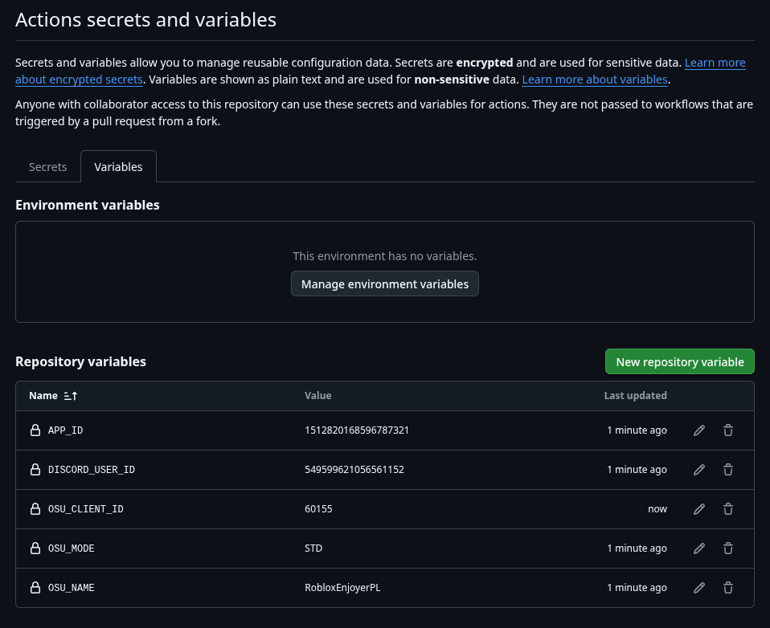
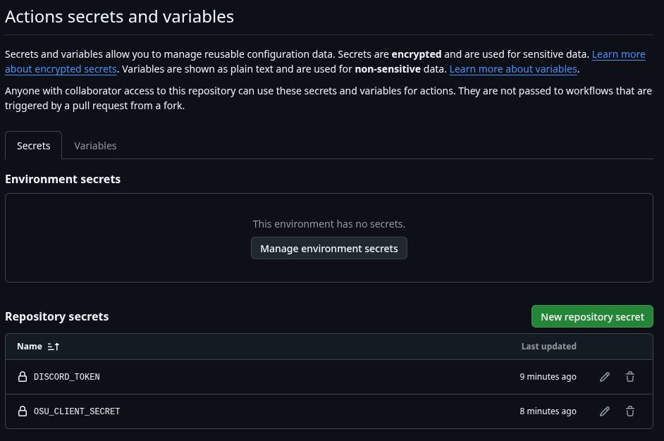

## Example Surface Layout




## Prerequisites

Before running the script, you will need to register applications on both developer portals:

1. **osu! API Credentials:** Go to your [osu! Account Settings](https://osu.ppy.sh/home/account/edit#oauth), scroll down to **OAuth Applications**, and click **New Application**. Copy your `Client ID` and `Client Secret`.
2. **Discord App Credentials:** Go to the [Discord Developer Portal](https://discord.com/developers/applications), create an application, and retrieve your `Application ID` (App ID) and Bot `Token`.

## Installation

Clone the repository and install the required dependencies:

```bash
pnpm install

```

Ensure you have your TypeScript configuration set up if you are compiling manually, or use `ts-node` / `tsx` to execute the file directly.

## Configuration

Copy `.env.example` to a new file named `.env` in the root directory and populate it with your environment variables. In src/index.ts replace `OSU_USERNAME` with yours.

## Usage

To execute the synchronization pipeline once:

```bash
pnpm dlx tsx src/index.ts

```

## Automation (GitHub Actions)

This repository includes a pre-configured GitHub Actions workflow that automatically runs the profile synchronization script every day at midnight UTC. You can also trigger it manually at any time via the **Actions** tab in your repository.

### Setting up automated updates:

To make the automated workflow work, push your code to GitHub and add your environment variables in your repository settings (**Settings** -> **Secrets and variables** -> **Actions**):

**Repository Secrets:**

* `DISCORD_TOKEN` - Your Discord bot token.
* `OSU_CLIENT_SECRET` - Your osu! application client secret.

**Repository Variables:**

* `APP_ID` - Your Discord application ID.
* `DISCORD_USER_ID` - Your personal Discord User ID.
* `OSU_CLIENT_ID` - Your osu! application client ID.
* `OSU_NAME` - Your osu! username.
* `OSU_MODE` - Your preferred osu! game mode (e.g., `STD`, `MANIA`, `TAIKO`, `CATCH`).




# Roadmap

* Support for discord application slashcommands (User identity refreshing via command)
